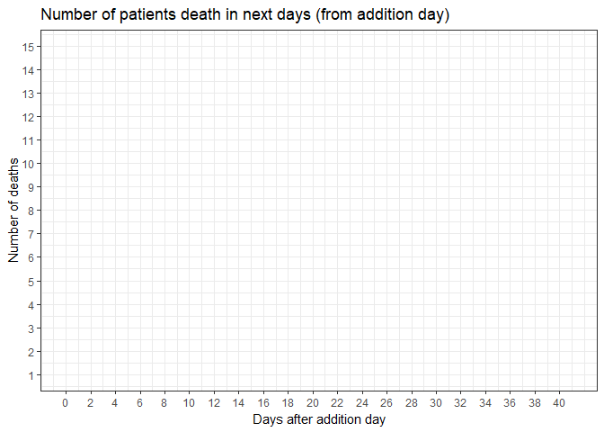
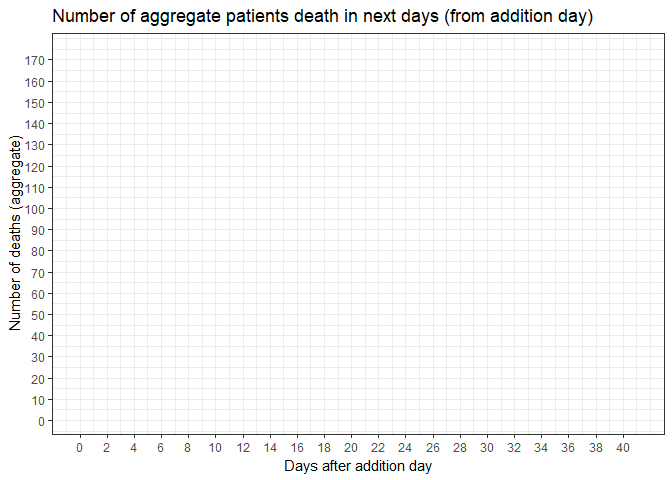

```{r setup, include=FALSE}
knitr::opts_chunk$set(echo = TRUE)
dplyr <- library(dplyr)
ggplot2 <- library(ggplot2)
readxl <- library(readxl)
knitr <- library(knitr)
tidyr <- library(tidyr)
lubridate <- library(lubridate)
plotly <- library(plotly)
gtsummary <- library(gtsummary)
gganimate <- library(gganimate)
caret <- library(caret)
pROC <- library(pROC)
ModelMetrics <- library(ModelMetrics)
ggraph <- library(ggraph)
igraph <- library(igraph)
bibtex <- library(bibtex)
```

# Introduction
In 2020, the entire world was shaken by the global SARS-CoV-2 pandemic. The first case was reported in China in mid-December 2019. The animal and seafood market in Wuhan, China, is indicated as source of the disease. A lot of countries introduced a state of emergency to limit the spread of the virus. Unfortunately, due to many interstate connections, the connections, the virus spread very quickly to many continents.

The SARS-CoV-2 virus causes the COVID-19 disease, which the symptomps are very similar to those of the seasonal flu. The virus affects the respiratory organs, mainly the lungs.The disease is most dangerous for the elderly and people with so-called concomitant diseases (e.g. diabetes, lung diseases, cardiovascular diseases). Common symptoms of coronavirus infection are:
<ul>
  <li> High fever </li>
  <li> Cough </li>
  <li> Dyspnea </li>
</ul>
The disease may lead to complications, e.g. pneumonia, acute respiratory distress syndrome.

To date (November 2020) there is no vaccine or effective antiviral drugs. Treatment is based on symptomatic treatment and supportive therapy (in the case of respiratory disorder). In order to counteract the spread of disease, frequent hand washing and surface disinfection are recommended.

The economy was significantly affected by the pandemic. Many countries have decided on implementing the so-called Lockdown - a temporary shutdown of the economy in order to avoid rallying people and infecting others. The education system also suffered - online learning was introduced in many schools and universities.

## About the document
The following document is a coronavirus cases study based on [article](https://www.nature.com/articles/s42256-020-0180-7) published on May 14, 2020. The data concerns 375 patients from Wuhan region of China (Tongji Hospital). In the conducted analysis, the most discriminating biomarkers of patient mortality were identified using machine lerning tools. The problem was defined as a classification task, where the input data included blood samples and laboratory test results.

## Used libraries
This report is using following R libraries:
<ul>
  <li>`r dplyr[1]`</li>
  <li>`r ggplot2[1]`</li>
  <li>`r readxl[1]`</li>
  <li>`r knitr[1]`</li>
  <li>`r tidyr[1]`</li>
  <li>`r lubridate[1]`</li>
  <li>`r plotly[1]`</li>
  <li>`r gtsummary[1]`</li>
  <li>`r gganimate[1]`</li>
  <li>`r caret[1]`</li>
  <li>`r pROC[1]`</li>
  <li>`r ModelMetrics[1]`</li>
  <li>`r ggraph[1]`</li>
  <li>`r igraph[1]`</li>
  <li>`r bibtex[1]`</li>
</ul>

## Dataset - description
Data is import from flat file.

```{r load_datas, cache=TRUE}
cov_cs_df <- read_excel("data\\wuhan_blood_sample_data_Jan_Feb_2020.xlsx")
```


Dataset has `r nrow(cov_cs_df)` rows and `r ncol(cov_cs_df)` columns. It is too much to show them all. Below there is only few of columns:
```{r show_head, warning=FALSE}
kable(head(cov_cs_df[1:10], 5))
```

We see, that first 7 columns are describing patients, the others are about the result of the research of their blood. Below the meaning of each column:
<ol>
  <li> <b> PATIENT_ID </b> - identifier of patient in dataset; in dataset is `r max(cov_cs_df$PATIENT_ID, na.rm=TRUE)` unique patients </li>
  <li> <b> RE_DATE </b> - date of research; first research was made `r min(cov_cs_df$RE_DATE, na.rm=TRUE)` and the last was made `r max(cov_cs_df$RE_DATE, na.rm=TRUE)`</li>
  <li> <b> age </b> - age of patient; the youngest patient was `r min(cov_cs_df$age, na.rm=TRUE)` years old and the oldest was `r max(cov_cs_df$age, na.rm=TRUE)` years old</li>
  <li> <b> gender </b> - sex of the patients </li>
  <li> <b> Admission time </b> - date of the admission patient; first patient was admit `r min(cov_cs_df$"Admission time", na.rm=TRUE)` and the last was `r max(cov_cs_df$"Admission time", na.rm=TRUE)` </li>
  <li> <b> Discharge time </b> - date of the discharge patient; first patient was discharge `r min(cov_cs_df$"Discharge time", na.rm=TRUE)` and the last was `r min(cov_cs_df$"Discharge time", na.rm=TRUE)`</li>
  <li> <b> outcome </b> - did the patient survived or died</li>
  <li> <b> Hypersensitive cardiac troponin I </b> - cardiac troponins are the proteins that are part of the heart muscle cells; in the healthy person their concentration is close to zero but it rises after hearth attack </li>
  <li> <b> hemoglobin </b> - it is responsible for the red color of blood and its primary fucntion is to transport oxygen; Hemoglobin norms in adults:
    <ul>
      <li> women - 12,0 - 16,0 g/dl (7,2 - 10,0 mmol/l) </li>
      <li> men - 14,0- 18,0 g/dl (7,8 - 11,3 mmol/l) </li>
      <li> pregnant women - 11 – 14 g/dl (6,9–8,8 mmol/l) </li>
    </ul>
  </li>
  <li> <b> Serum chloride </b> - Chlorine is the major anion of the extracellular factor, inlcuding blood plasma; The proper concentration of chlorides in the blood ensures the proper functioning of the neuromuscular and digestive systems; normal concentraion of chloride in the blood: 95–105 mmol/l. The concentration in women is on average slightly higher (by 2–2.5 mmol/l) in women than in men  </li>
  <li> <b> Prothrombin time </b> - it is a parameter describing efficiency of the extrinsic coagulation system; normal result is 12 - 16 seconds </li>
  <li> <b> procalcitonin </b> - PCT is a substance whose presence in the blood indicates a bacterial infection. Testing procalcitonin levels allows early diagnosis of infection, even when no symptoms are present yet; in the healthy person the condensation is low (<0.1 ng/mL) but when it is > 0.5 ng/mL it is characteristic for bacterial infection </li>
  <li> <b> eosinophils(%) </b> - it is a type of white blood cell, also known as leukocytes; their main task is to participate in the immune response of our body;  the correct percentage of eosinophils as a component of leukocytes, depending on the adopted standards, ranges from 1-5%</li>
  <li> <b> Interleukin 2 receptor </b> - it is cytokine (protein) that incluences, among other things, the activity of lymphocytes.</li>
  <li> <b> Alkaline phosphatase </b> - known as ALP, is an enzyme that occurs in many cells of the human body; depending on the place of occurrence reaches different concentrations; the norms are established based on the age of patient  </li>
  <li> <b> albumin </b> - is the main serum protein procued in the liver; their main role in the human body is to transport hormones(e.g. cortisol) drugs (e.g. antibiotics) as well as vitamins, fatty acids and lipids; the norms depends e.g. age of patient, gender, determination method; approximate norms for particular periods of life:
    <ul>
      <li> children (not preterm): 4.6-7.4 g/dl </li>
      <li> 7-19 years: 3.7-5.6 g/dl </li>
      <li> adults: 3.5-5.5 g/dl </li>
    </ul>
  </li>
  <li> <b> basophil(%) </b> - they are one of the morphotic components of blood; make up only about 1% of leukocytes, i.e. white blood cells; they are involved in boyd's defense against penetrating microorganisms; it is assumed that basophils should be up to 1% of leukocytes, that is, all white blood cells</li>
  <li> <b> Interleukin 10 </b> - it is a cytokine (protein); their main function is to block inflammatory process </li>
  <li> <b> Total bilirubin </b> - direct and indirect bilirubin form total bilirubin - a yellow pigment, a product of breakdown of red blood cells; the norm for total bilirubin is 0,2-1,1 mg% (3,42-20,6 µmol/l) </li>
  <li> <b> Platelet count </b> - thrombocytes, or platelets, are, next to white and red blood cells, blood cells; platelets play a key role in the clotting process;	 the normal count of platelets is 150-400 thousand on µl </li>
  <li> <b> monocytes(%) </b> - are white blood cells and are the largest blood cells in our bloodstream; have, among others the ability to phagocytose bacteria and to produce various mediators of the immune response, such as interferon; the norm for the adults is 4-8% of total amount among all leukocytes </li>
  <li> <b> antithrombin </b> - it is an antigen synthesized mainly in the liver and endothelium of blood vessels. megakaryocytes and platelets; in a healthy human, plasma is from 20 to 29 IU/ml with an activity of 75-150%; antithrombin is the main inhibitor of plasma thrombin and is therefore used to assesss the state of coagulation system </li>
  <li> <b> Interleukin 8 </b> - it is a cytokine that stimulates the migration of immune cells in the body; this means that it stimulates the movement and spread of T lymphocytes, neutrophils and monocytes; this action is is defensive in nature </li>
  <li> <b> indirect bilirubin </b> - indirect bilirubin is a part of total bilirubin; the norms for indirect bilirubin is 0.2 – 1.0 mg/dl </li>
  <li> <b> Red blood cell distribution width </b> - this indicator in blood counts tells what the volume differences are between individual red blood cells in a patient; the values are given in femtoliters (fl); generally, 36-47 fl is considered the standard </li>
  <li> <b> neutrophils(%) </b> - this is the most numerous group of white blood cells of the immune system; the task of neutrophils is to protect the body against infections and diseases (they provide so-called cellular immunity); both their low blod level and excess can indicate many serious diseases; the norm for neutrophils is 60-70% of all white blood cells </li>
  <li> <b> total protein </b> - it is a laboratory test that measures the concentration of all proteins in the blood; protein is an important componen of plasma. It maintains adequate pressure inside blood vessels, transport nutrients, is involved in the coagulation processes and in the defense of the body; the correct level of total protein is between 60 and 60 g/l or between 6 and 8 g/dl </li>
  <li> <b> Quantification of Treponema pallidum antibodies </b> - Treponema pallidum is a bacteriom that is the etiological factor of venereal disease, syphilis. </li>
  <li> <b> Prothrombin activity </b> - this is a protein factor; is responsible for the formation of thrombin; the so-called Quick's Index, i.e. the percentage of the norm - the correct result is in the range of 70-130%</li>
  <li> <b> HBsAg </b> - it is an antigen, a surface protein; its presence may indicate hepatitis B or a carrier of KBV; the presence of HBsAg is checked in the blood serum </li>
  <li> <b> mean corpuscular volume </b> - known as MCV; it is an indicator showing the volume of red blood cells, i.e. erythrocytes; the reference range for MCV is assumed to be 82-82 fl </li>
  <li> <b> hematocrit </b> - it is a ratio of blood cell volume to total blood cell volume to total blood volume; it is expressed as a percentage; the results depend primarily on the age, sex, study population; physical effort the the patient is engaged in, and even the method of determining; sample norms for specific sexes are as follows:
    <ul>
      <li> Womes: 36.1-44.3% </li>
      <li> Males: 40.7-50.3%</li>
    </ul>
  </li>
  <li> <b> White blood cell count </b> - leukocytes are white blood cells; in the human body, leukocytes play a very important role in the functioning of the immune system - they protect against cancer and infections; example of norms for blood leukocytes for adults are 4-10 thousand/μl </li>
  <li> <b> Tumor necrosis factor α </b> - it is a cytokine (protein) associated with the inflammatory process, produced mainly by active monocytes and macrophages, and in much smaller amounts by other tissues; the primary role of the tumor necrosis factor in the body is to modulate the inflammatory response; the norm o TFA-α is under 16 pg/ml </li>
  <li> <b> mean corpuscular hemoglobin concentration </b> - the norms for mean corpuscular hemoglobin concentration are between 19.2 and 23.6 mmol/l</li>
  <li> <b> fibrinogen </b> - it is a protein involved in the blood clotting prcess; the norm is 2-5 g/l </li>
  <li> <b> Interleukin 1β </b> - it is a cytokine that are crucial in the process of inflammation; it is produced in response to various types of antigens; the factors that stimulate its production can be bacteria, viruses or fungi; acts as a universal stimulant of the inflammatory response; it also has the ability to stimulate cells to produce other pro-inflammatory cytokines </li>
  <li> <b> Urea </b>	- is the final product of protein metabolism in the body and as such is an indicator of kidney function; the appropriate standard of urea concentration is 2.5-6.7 mmol/l </li>
  <li> <b> lymphocyte count </b> - lymphocytes are a group of leukocytes - white blood cells; they protect us against infections and the development of cancer; the norm in an adult i sbetween 1000 and 5000; both their excess and their shortage may have serious consequences </li>
  <li> <b> PH value </b> - is a test that is ordered to confirm respiratory disorders; norms for pH (normal arterial blood: 7.35-7.45; venous blood: 7.32-7.42) </li>
  <li> <b> Red blood cell count </b> - the norms of erythrocytes in adults:
    <ul>
      <li> women: 4.2-5.4 million/mm³ </li>
      <li> males: 4.5-5.9 million/mm³ </li>
    </ul>
  </li>
  <li> <b> Eosinophil count </b> - the normal number of eosinophils in peripheral blood is 35-350 in 1 mm³ (mean is 125) </li>
  <li> <b> Corrected calcium </b> - calcium is a macronutrient element - its content in the adult human body is about 20-25 g/kg of lean body mass; calcium formula corrected calculates the theoretical concentration of calcium in a patient if the serum albumin concentration was 40 g/l; the reference values are 8.8-10.6 mg/dl </li>
  <li> <b> Serum potassium </b> - the test is designed to determine the concentration of potassium in the blood serum; the normal level is 3.5-5.0 mmol/l</li>
  <li> <b> glucose </b> - is a simple sugar that is the primary source of energy in the human body; it is needed for human organs to function properly; the blood sugar value depends on the patient's age - for the adults norm is 3.9-5.5 mmol/l</li>
  <li> <b> neutrophils count </b> - the reference values for the amount of neutrophils in the blood are 1800-8000/μl - that is the number of cells per microliter of blood tested </li>
  <li> <b> Direct bilirubin </b> - direct bilirubin is a part of total bilirubin; the norm between 1.7-6.8 µmol/l </li>
  <li> <b> Mean platelet volume </b> - normally, the value of average platelet volume ranges between 9 and 12.6 μm³ </li>
  <li> <b> ferritin </b> - it is an acute phase protein (its level increases when inflammation develops), found in the bone marrow, liver and spleen, kidneys and skeletal muscles; ferritin is a specific store of iron that protects the body in the event of incresed demand for this element and procets against its excess; in women, the level of ferritin should not exceed 200 mcg/l, in men 400 mcg/l and the result below 12 mcg/l indicates a deficiency</li>
  <li> <b> RBC distribution width SD </b> - is an indicator of red blood cell volume distribution; erythrocytes, or red blood cells are not indentical; the task of the RBC-SD index is to assess the differences in the volume of erythrocytes in the examined person; the RDW-SD norm is 36-47 fl (femtoliters) </li>
  <li> <b> Thrombin time </b> - thrombin time (TT) is a diagnostic test that allows a partial assessment of the coagulation system; on the basis of TT, it can be determined how long it takes for the final stage of blood clotting, i.e. the conversion of fibrinogen to fibrin; the correct value of the thrombin time should be in the range from 12 to 24 second </li>
  <li> <b> (%)lymphocyte </b> - normal percentage value of the lymphocyte is between 10-45% all white blood cells  </li>
  <li> <b> HCV antibody quantification </b> - measurement of the amount of ribonucleic acid (RNA) of the hepatitis C virus (HCV) in the blood; an early response to treatment should be demonstrated by a fall viral load greater tha 2 logs after the first 12 weeks of treatment </li>
  <li> <b> D-D dimer </b> - they are a product of the breakdown of fibrin - a protein precipitated from the blood plasma during the coagultion process; the concentrations of D-D dimers in the plasma increase during the increased production of fibrin, which is related to the formation of clots that impede the proper blood flow; the concentration of D-D dimers is considered normal less that 500 μg/l </li>
  <li> <b> Total cholesterol </b> - it is producet in the liver and is supplied to the body with food and released into bloodstream; it is needed, among others the proper functioning of the nervous system; its excess may unfortunately increase the risk of a heart attack and stroke; for total cholesterol, it is assumed that the correct values shoudl be within the range of 200 mg/dl</li>
  <li> <b> aspartate aminotransferase </b> - is an intracellular enzyme found in the liver, heart muscles, kidneys and red blood cells; it enters the blood when there is cell damage; if a biochemical test shows increased activity, it usually means that we are dealing with one of the liver diseases; the norm for aspartate aminotransferase is in the range from 5 to 40 U/l </li>
  <li> <b> Uric acid </b> - it is an organic chemical compound that is one of the end products of metabolism; sometimes it accumulates in large amounts in the blood in the course of some metabolic diseases; the correct level of uric acid should be 180-420 µmol/l </li>
  <li> <b> HCO3- </b> - is a test of plasma bicarbonate concentration; the standard is 22-28 mmol/l</li>
  <li> <b>  calcium </b> - calcium is present in the serum in ionized Ca<sup>+2</sup> and bound form; decreased levels of calcium in the body (hypocalcaemia) are manifested by, among others, muscle cramps, joint pain, tingling and numbness; normal total calcium levels are 2.12-2.62 mmol/l </li>
  <li> <b> Amino-terminal brain natriuretic peptide precursor(NT-proBNP) </b> - is a cardiac marker; NT-proBNP is performed when heart failure is suspected; during myocardial infarcion, a significant increase in NT-proBNP is observed; the norm of NT-proBNP plasa concentration is 68-112 pg/ml</li>
  <li> <b> Lactate dehydrogenase </b> - it is an encyme that occurs in all cells of the human body; in the event of cell damage, lactate dehydrogenase is released from inside them, its concentration and activity increase in the blood; blood lactate dehydrogenase activity level is <480 IU/l </li>
  <li> <b> platelet large cell ratio </b> - that is, the percentage of large as well as giant platelets in the blood in the test sample; this parameter indicates that there are platelets in the patient's bloodstream that are much larger than those within the specified for P-LCR is less than 30% of large platelets</li>
  <li> <b> Interleukin 6 </b> - is a signaling molecule belonging to the group of cytokines; is responsible for initiating and developing the inflammatory response in the body </li>
  <li> <b> Fibrin degradation products </b> - the degradation products of fibrinogen and fibrin are fragments of fibrin formes as a result of the intensification of the process of fibrinolysis - the breakdown of intravascular clots; they are formed by the action of plasmin on fibrin and fibrinogen; the norm is a result below 800 ng/ml </li>
  <li> <b> monocytes count </b> - 30 to 800 monocytes per microliter of blood are considered normal</li>
  <li> <b> PLT distribution width </b> - determines what percentage of all thrombocytes has different volume than a medium-sized thrombocyte; for PLT distribution width a value from 6.1 to 11 fl is normal</li>
  <li> <b> globulin </b> - is responsible in the human body for modulating immune processes; the norm should be from 5 to 15 g/l </li>
  <li> <b> γ-glutamyl transpeptidase </b> - (GGTP) is a membrane enzyme present in many tissues and body fluid of humans; the norm of GGTP activity in the blood is:
    <ul>
      <li> women: <35 IU/l</li>
      <li> men: <40 IU/l </li>
    </ul>
  </li>
  <li> <b> International standard ratio </b> - expresses prothrombin time which is one of the most important parameters in the examination of the coagulation system; under normal conditions, it is assumed that the norm is 0.8-1.2 </li>
  <li> <b> basophil count(#) </b> - basophils are one of the morphotic components of the blood; they take part in the body's defense against penetrating microorganisms; it is assumed that basophils should constitute 0-300 cells per microliter of blood </li>
  <li> <b> 2019-nCoV nucleic acid detection </b> - test that finds the presence of nucleic acid in the patient's blood </li>
  <li> <b> mean corpuscular hemoglobin </b> - is an indicator of the average concentration of hemoglobin in the red blood cell; this parameter allows to assess the functionality of red blood cells in our body; the norm is 19.2-23.6 mmol/l </li>
  <li> <b> Activation of partial thromboplastin time </b> - it is a test that measures the coagulation time of the plasma in the presence of kephalin and calcium ions after activation with kaolin clay; the test is performed when a deficiency of coagulation factors and fibrinogen is suspected; the norm is about 26-46 second </li>
  <li> <b> High sensitivity C-reactive protein </b> - is a C-reactive protein i.e. one of the so-called acute phase proteins appearing in the blood as a consequence of inflammation; it is produced under the influence of inflammatory cytokines; tests are performed in cases where the risk of bacterial infection increases or there is such a suspiction based on existing symptoms; in a helthy person, the concentration is not high, not more than 5 mg/l </li>
  <li> <b> HIV antibody quantification </b> - determination of HIV-1 genetic material in blood, useful in assessing the effectiveness of antiviral therapy and in the prognosis of AIDS development</li>
  <li> <b> serum sodium </b> - the indicator for the test is suspected reduced concentration (so-called hyponatremia) or increased sodium concentration (so-called hypernatremia); the correct concentration is 135-145 mmol/l </li>
  <li> <b> thrombocytocrit </b> - is the ratio of thrombocyte volume to plasma; deviations may indicate a blood coagulation disored </li>
  <li> <b> ESR </b> - is the rate of descent of red blood cells over time; ESR norm depends on age and gender; ESR norms in blood test:
    <ul>
      <li> newborns: 0-2 mm/h </li>
      <li> infants (from 6 month of age): 12-177 mm/h </li>
      <li> women under 50: 6-11 mm/h </li>
      <li> women over 50: up to 30 mm/h </li>
      <li> males under 50: 3-8 mm/h </li>
      <li> men over 50: up to 20 mm/h </li>
    </ul>
  </li>
  <li> <b> glutamic-pyruvic transaminase </b> - it is the enzyme most commonly found in the liver, but is also found in skeletal muscle, heart muscle and kidneys; in a helthy person whose liver works properly, its level should be insignificant; the result considered as normal should not exceed 35-400 IU/l </li>
  <li> <b> eGFR </b> - colloquially it is called glomerular filtration; this indicator is a measurement of the amount of blood that gets filtered by the kidneys; normally the result should be greater than or equal to 90 ml/min/1.73m<sup>2</sup> </li>
  <li> <b> creatinine </b> - is a substance that is formed in our body as a result of metabolic changes from creatine phosphate by non-enzymatic breakdown of this compound; its concentration in blood and urine gives us information about the efficiency of our kidneys; the correct level of creatinine in the blood serum ranges from 53 to 115 μmol/l </li>
</ol>


# Analysis
## Introductory Part
### Cleaning Process
That shows us, the dataset is illegible. Fisrt, we need to clean data to enhance readability of dataset.

```{r cleaning_data}
data_df <- cov_cs_df %>%
              mutate(gender = as.factor(ifelse(gender==1, "male", "female"))) %>%
              mutate(outcome = as.factor(ifelse(outcome == 0, "survived", "died"))) %>%
              rename(admission_time = 'Admission time',
                     discharge_time = 'Discharge time')

colnames(data_df)[34] <- "Tumor_necrosis_factor_alfa"
colnames(data_df)[37] <- "Interleukin_1_Beta"
colnames(data_df)[68] <- "gamma_glutamyl_transpeptidase"

patients_df <- data_df %>%
                select(PATIENT_ID, age, gender, admission_time, discharge_time, outcome) %>%
                drop_na(PATIENT_ID) %>%
                mutate("hospitalization_length" = seconds_to_period(difftime(discharge_time,
                                                                             admission_time,
                                                                             units = "days" ))) %>%
                relocate(hospitalization_length, .after = discharge_time)

data_df <- data_df %>% 
            fill(PATIENT_ID)
```

After replace NA values in PATIENT_ID column, the dataset looks like below.

```{r after_cleaning_1}
kable(head(data_df[1:8], 10))
```

We know, that most patients had multiple blood samples taken throughout their stay in hospital. To prepare model of prediction the mortality of patient, next step of cleaning process is to extract only one observation to patient. The model training and testing will use only the data from final sample.

```{r cleaning_process_2}
data_df <- data_df %>%
            group_by(PATIENT_ID) %>%
            fill(colnames(data_df)) %>%
            summarise(across(everything(), last), .groups="drop")
```

Still, we see, there is a NA values in some column. This requires replacing these values. It is possible to do it in many ways, but here, the NA values in each column will be replace by median of the values in column.


```{r median_instead_na_val, warning=FALSE}
for(i in 8:ncol(data_df))
{
  val <- data_df[i]
  val[is.na(val)] <- median(val[!is.na(val)])
  data_df[i] <- val
}


```

After that, the dataset is clean and looks like below.
```{r after_cleaning_2}
kable(head(data_df[1:8], 10))
```

### Summary
Below short summary of clean dataset.

```{r summary_clean_df, warning=FALSE, error=FALSE, message = FALSE}
tbl_summary(
  data_df,
  by = outcome,
  label = gender ~ "Gender") %>%
  add_n() %>%
  modify_header(label = "") %>%
  add_overall() %>%
  bold_labels()
```


With clean dataset, it is possible to start analyse dataset.

## Proper part
### Plots including data about gender, age and hospitalization length

First, we can check number of patients divided into genders.
```{r patients_gender_plot, fig.width=10, warning = FALSE, message = FALSE}
gender_bar_plot <- ggplot(patients_df, aes(x = gender, fill = gender)) +
                geom_bar() +
                theme_bw() + 
                labs(title = "Number of patients divided into gender",
                    x = "Gender",
                    y = "Number of patients",
                fill = "Gender")
ggsave(filename = "gender_bar_plot.svg",
       plot = gender_bar_plot,
       device = "svg",
       path = "plots")
ggplotly(gender_bar_plot)
```


Below the chart showing ages of patients.
```{r patients_age_gender_hist, fig.width=10, warning = FALSE, message = FALSE}
gender_age_hist <- ggplot(patients_df, aes(x = age, fill=gender)) +
                    geom_histogram(binwidth = 5.0) +
                    theme_bw() +
                    labs(title = "Histogram of patients age and genders.",
                         x = "Age",
                         y = "Number of patients",
                         fill = "Gender") +
                    scale_x_continuous(breaks = seq(0, max(patients_df$age), 5))
ggsave(filename = "gender_age_plot.svg",
       plot = gender_age_hist,
       device = "svg",
       path = "plots")
ggplotly(gender_age_hist)
```

It is possible to create two histograms for each gender.
```{r patients_age_gender_hists, fig.width=10, warning=FALSE, message = FALSE}
gender_age_histograms <- ggplot(patients_df, aes(x = age, fill=gender)) +
                          geom_histogram(binwidth = 5.0) +
                          theme_bw() +
                          facet_wrap(~gender) +
                          labs(title = "Histogram of patients age and genders.",
                               x = "Age",
                               y = "Number of patients",
                               fill = "Gender") +
                          scale_x_continuous(breaks = seq(0, max(patients_df$age), 5))
ggsave(filename = "gender_age_histograms.svg",
       plot = gender_age_histograms,
       device = "svg",
       path = "plots")

ggplotly(gender_age_histograms)
```


Let show the histograms about outcome due to hospitalization length.
First, histogram including each genders.
```{r patients_hospitalization_length, fig.width = 10, message = FALSE, warning = FALSE}
hosp_length_hist <- ggplot(patients_df, aes(x = hospitalization_length, fill = gender)) + 
                      geom_histogram(binwidth = 1.0) +
                      theme_bw() +
                      scale_x_continuous(breaks=seq(0, max(patients_df$hospitalization_length), 1)) +
                      labs(title = "Number of patients and their hospitalization length",
                           x = "Hospitalization length (in days)",
                           y = "Number of patients", 
                           fill= "Gender")
ggsave(filename = "hospitalization_length_histograms.svg",
       plot = hosp_length_hist,
       device = "svg",
       path = "plots")

ggplotly(hosp_length_hist)
```


Next chart will be the histogram including information about did the patient survived or died.
```{r patients_hosp_length_outcome, fig.width = 10, warning = FALSE, message = FALSE}
hosp_length_outcome_hist <- ggplot(patients_df, aes(x = hospitalization_length,
                                                    fill = outcome)) +
                              geom_histogram(binwidth = 1.0) +
                              theme_bw() +
                              scale_x_continuous(breaks = seq(0, max(patients_df$hospitalization_length), 1)) +
                              labs(title = "Number of patients, their hospitalization length and outcome (survived or died)",
                                   x = "Hospitalization length (in days)",
                                   y = "Number of patients",
                                   fill = "Outcome")

ggsave(filename = "hospitalization_length_outcome_histogram.svg",
       plot = hosp_length_outcome_hist,
       device = "svg",
       path = "plots")


ggplotly(hosp_length_outcome_hist)
```

Next, the histograms including every information above, but divided by genders and outcomes.
```{r patients_hosp_length_groups, fig.width = 10, warning = FALSE, error = FALSE}
hosp_length_outcomes_hists <- ggplot(patients_df, aes(x = hospitalization_length,
                                                    fill = outcome)) +
                              geom_histogram(binwidth = 1.0) +
                              theme_bw() +
                              facet_grid(gender~outcome) +
                              scale_x_continuous(breaks = seq(0, max(patients_df$hospitalization_length), 5)) +
                              scale_y_continuous(breaks = seq(0, 20, 4)) +
                              labs(title = "Number of patients, their hospitalization length and outcome (survived or died)",
                                   x = "Hospitalization length (in days)",
                                   y = "Number of patients",
                                   fill = "Outcome")

ggsave(filename = "hospitalization_length_outcomes_histograms.svg",
       plot = hosp_length_outcomes_hists,
       device = "svg",
       path = "plots")

ggplotly(hosp_length_outcomes_hists)
```

### Animated plots
Following charts will be animated. Next will show the number of patients death in next days
```{r create_animated_deaths_plot, fig.width = 10}
patients_death <- patients_df %>%
                    select(discharge_time, outcome) %>%
                    filter(outcome == "died") %>%
                    mutate(discharge_time = as.integer(difftime(discharge_time,
                                                        min(patients_df$discharge_time),
                                                        units="days"))) %>%
                    group_by(discharge_time) %>%
                    summarise(num_of_deaths = n(), .groups="drop")

animated_deaths_plot <- ggplot(patients_death, aes(x = discharge_time,
                                            y = num_of_deaths)) +
                  geom_line(color = "blue",
                            size=1.5) +
                  theme_bw() +
                  labs(title = "Number of patients death in next days (from addition day)",
                       x = "Days after addition day",
                       y = "Number of deaths") +
                  scale_x_continuous(breaks = seq(0, max(patients_death$discharge_time), 2)) +
                  scale_y_continuous(breaks = seq(0, max(patients_death$num_of_deaths), 1)) +
                  transition_reveal(discharge_time)

anim_save("plots/deaths.gif", animated_deaths_plot)
```

 


The chart below will show the aggregate number of deaths in next days.
```{r create_animated_agg_deaths_plot}
patients_death <- patients_death %>%
                    arrange(discharge_time) %>%
                    mutate(num_of_deaths_agg = cumsum(num_of_deaths))

animated_deaths_agg_plot <- ggplot(patients_death,
                                   aes(x = discharge_time,
                                       y = num_of_deaths_agg)) +
                              geom_line(color = "blue",
                                        size = 1.5) +
                              theme_bw() +
                              labs(title = "Number of aggregate patients death in next days (from addition day)",
                                   x = "Days after addition day",
                                   y = "Number of deaths (aggregate)") +
                              scale_x_continuous(breaks = seq(0, max(patients_death$discharge_time), 2)) +
                              scale_y_continuous(breaks = seq(0, max(patients_death$num_of_deaths_agg), 10)) +
                              transition_reveal(discharge_time)

anim_save("plots/deaths_agg.gif", animated_deaths_agg_plot)
```
 


## Machine Learning Model

In the following chapter, an attempt was made to create a model that will determine the probability of death from COVID-19 based on observations and results of the blood tests.

It is assumed, that each row will be separate observation of unique patient.
At the beginning you should extract right columns from dataset. The column containing id of the patients is not needed - just like the columns with dates of research and admission/discharge time (we do not know how long the patient will be hospitalizing).
Also, we need to shuffle rows in dataframe. It is necessary, because first patient which died, is on `r which(as.vector(data_df$outcome) %in% "died") %>% first()` position in dataframe and we cannot start teaching models before both classes will occur in dataset.
To ensure repeatability of the shuffling, the seed is seting.

```{r data_extracting_and_shuffling}
ml_df <- data_df %>%
          select(-c("PATIENT_ID", "RE_DATE", "discharge_time","admission_time"))
set.seed(17)
rows <- sample(nrow(ml_df))
ml_df <- ml_df[rows,]

```

After preparing the dataset, it is possible to split data into two datasets: 
<ul>
  <li> training dataset - the model will be learning on this datas </li>
  <li> testing dataset - learned model will be tested with this datas </li>
</ul>

As the learning procces, the repeated cross-validation method was choosen. It means, that the learning procces will be done several times (argument *repeats* in the *trainControl* function). Each time, the training set will be splitting into two sets, training set and validation set.
The training set will be used to learn model and after that, will be validate with validation set.

```{r dividing_set, warning=FALSE}
inTraining <- createDataPartition(y = ml_df$outcome, p=.70, list=FALSE)
training <- ml_df[inTraining,]
testing <- ml_df[-inTraining,]

ctrl <- trainControl(method="repeatedcv",
                     number = 2,
                     repeats = 5,
                     classProbs = TRUE)
```


The following subchapters will checking some machine learning methods and the differences between them in accuracy, performance and errors.

### k Nearest Neighbours

The Nearest Neighbours classifier belongs to group of classifiers based on instance methods. The classification process is done online when a new case needs to be classified. Such methods are generally called lazy learning methods.
The idea behind k-NN algorithm is as follows. When there is a need to classify a new object *X*, the k_NN classifier searches in the pattern space for *k* objects of the training set closest to the object *X*. Object *X*, using majority voting, is assigned to the class that dominates in the set of its *k* nearest neighbours.

At the beginning, the seed is seting. It ensure the repeatability of experiments.
```{r knn_seed}
set.seed(17)
```


Then, it is possible to start learn process with k-NN method. The attribute *k* is seting on 10.
```{r knn_training}
tGrid <- expand.grid(k = 10)
knn_fit <- train(outcome ~ .,
                data = training,
                method = "knn",
                trControl = ctrl,
                tuneGrid = tGrid)
```


After training process, the model needs to be tested. The testing set will be used to do that.
As a result of testing the model, two types of results can be obtained:
<ul>
  <li> classifying samples into classes - this result is needed to create confusion matrix </li>
  <li> probability of samples of belonging to classes - this result is needed to create ROC curve </li>
</ul>
In the following lines, both type of results will be obtained.

```{r knn_prediction}
knnClasses_prob <- predict(knn_fit,
                          newdata = testing,
                          type = "prob")

knnClasses <- predict(knn_fit,
                     newdata = testing)
```


With the result with classified samples, it is possible to create confusion matrix.
The confusion matrix is the *m x m* matrix, where *m* is the number of class labels where the rows correspond to the actual class labels of the test records, and the columns to the class labels assigned to the test records by the classifier.
The `r caret[1]` library enables the function to create confusion matrix. This function returns confusion matrix and basic performance statistics.
```{r knn_confusionMatrix, warning=FALSE}
knn_confMatrix <- caret::confusionMatrix(data = knnClasses, testing$outcome)
knn_confMatrix
```

We see the basic performance statistics. The model is not perfect, but its prediction is quite good. 
Confusion matrix analysis is one of the many ways to assess the accuracy of the model. Another one is ROC curve and area under ROC curve (AUC).
ROC curve  is a performance measurement for classification problem at various thresholds settings. ROC is a probability curve and AUC represents degree or measure of separability. It tells how much model is capable of distinguishing between classes. Higher the AUC, better the model is at predicting survived as survived and died as died. By analogy, Higher the AUC, better the model is at distinguishing between patients with disease and no disease

```{r knn_ROC, warning = FALSE, message = FALSE, fig.width = 10}
knn_ROC <- roc(response = testing$outcome,
           predictor = knnClasses_prob[, "died"],
           levels = rev(levels(testing$outcome)))

plot(knn_ROC,
     print.auc = TRUE,
     col="black",
     lwd = 5)

legend("bottomright",
       col=c(par("fg"), "blue"),
       legend = c("Empirical"),
       lwd=5)

```


The AUC value is quite big. Now, its need to check if in our model occured so-called overfitting.
Overfitting is over-matching to the specificty of the training data is most often assciotaed with the loss of generalizability.
To check if model is or not is overfitted, the special function was created to create learning curves (similar functions was created also to others tested methods).

```{r knn_learning_curves_fun, warning = FALSE}
my_learning_curve_knn <- function(training_data,
                              test_data,
                              outcome = NULL,
                              trControl = NULL)
{
  train_len <- nrow(training_data)
  if(train_len < 2)
    stop("Training data must have at least 2 data points.")
  if(nrow(test_data) < 1)
    stop("Test data must have at least 1 data points")
  if(is.null(outcome))
    stop("Please give a character string for the outcome column name.")
  if(is.null(trControl))
    stop("Please put the train controller.")
  learnCurve <- data.frame(m = integer(train_len),
                           RMSE_type = character(train_len),
                           RMSE_value = integer(train_len))

  j <- 0
  tGrid <- expand.grid(k = 10)
  for (i in c(seq(5,train_len, 20), train_len))
  {
    j <- j + 1
    tr <- training_data[1:i,]
    set.seed(17)
    
    trainModel <- train(outcome ~ .,
                    data = tr,
                    method = "knn",
                    trControl = trControl,
                    tuneGrid = tGrid)
    
  
    learnCurve$m[j] <- i
    learnCurve$RMSE_type[j] <- "Training Error"
    learnCurve$RMSE_value[j] <- rmse(tr$outcome,
                                    predict(trainModel,
                                            newdata = tr))
    j <- j + 1
    
    learnCurve$m[j] <- i
    learnCurve$RMSE_type[j] <- "Testing Error"
    learnCurve$RMSE_value[j] <- rmse(test_data$outcome,
                                 predict(trainModel,
                                         newdata = test_data))
  }
  
  learnCurve[1:j,]
}
```

This function generates learning curves for testing and training set of model.
Below chart shows learning curves for training set and testing set.

```{r knn_learningFunction, warning = FALSE, fig.width = 10, warning = FALSE, message = FALSE}
knn_lmc <- my_learning_curve_knn(training_data = training,
                  test_data = testing,
                  outcome = "outcome",
                  trControl = ctrl)

knn_learning_curves <- ggplot(knn_lmc, aes(x = m)) +
                          geom_line(aes(y = RMSE_value, color = RMSE_type), size=2.0) + 
                          theme_bw() +
                          labs(title = "Learning Curves",
                               x = "Examples",
                               y = "RMSE value",
                               color = "Learning Curve")
ggsave(filename = "k_nn_learning_curves.svg",
       plot = knn_learning_curves,
       device = "svg",
       path = "plots")

ggplotly(knn_learning_curves)


```
On the graph we see the learning curves. On the *X* axis there is the number of examples that was included into training process. On the *Y* axis there is the value of root mean square error.
The chart with learning curves shows us, that error on training set is similar to error on testing set. It is not too big, so we can assume that model is not overfitted.

### SVM 
*SVM* is classification method whose learning aim is to determine the separating hyperplane with a maximum margin of examples belonging to two classes.

At the beginning, the seed is seting. It ensure the repeatability of experiments.
```{r svm_seed}
set.seed(17)
```


Then, it is possible to start learn process with *SVM* method. We choose the *svmRadial* method - the kernel used in training and predicting is based on radial basis.
```{r svm, warning=FALSE}
svm_fit <- train(outcome ~ .,
              data = training,
              method = "svmRadial",
              trControl = ctrl)
```

Like in the k-NN method, the prediction with samples classified and probability will be created.

```{r svm_perdiction}
svmClasses <- predict(svm_fit,
                      newdata = testing)
svmClasses_prob <- predict(svm_fit,
                           newdata = testing,
                           type = "prob")
```


Below the confusion matrix for the model with *SVM* method.

```{r svm_confMatrix}

svm_confMatrix <-caret::confusionMatrix(testing$outcome,
                                        svmClasses)
svm_confMatrix
```

The model made fewer errors than the *k-NN* model
Below the ROC curve for model with *SVM*.
```{r svm_ROC, warning = FALSE, message = FALSE, fig.width = 10}
svm_ROC <- roc(response = testing$outcome,
               predictor = svmClasses_prob[, "died"],
               levels = rev(levels(testing$outcome)))

plot(svm_ROC,
     print.auc = TRUE,
     col="black",
     lwd = 5)

legend("bottomright",
       col=c(par("fg"), "blue"),
       legend = c("Empirical"),
       lwd = 5)
```
*AUC* is big, like in the *k-NN* model.
Below the function for creating learning curves for *SVM* method.

```{r svm_learning_curve, warning=FALSE}
my_learning_curve_svm <- function(training_data,
                              test_data,
                              outcome = NULL,
                              trControl = NULL)
{
  train_len <- nrow(training_data)
  if(train_len < 2)
    stop("Training data must have at least 2 data points.")
  if(nrow(test_data) < 1)
    stop("Test data must have at least 1 data points")
  if(is.null(outcome))
    stop("Please give a character string for the outcome column name.")
  if(is.null(trControl))
    stop("Please put the train controller.")
  learnCurve <- data.frame(m = integer(train_len),
                           RMSE_type = character(train_len),
                           RMSE_value = integer(train_len))

  j <- 0
  tGrid <- expand.grid(k = 10)
  for (i in c(seq(20,train_len, 20), train_len))
  {
    j <- j + 1
    tr <- training_data[1:i,]
    set.seed(17)
    
    trainModel <- train(outcome ~ .,
                    data = tr,
                    method = "svmRadial",
                    trControl = ctrl)
    
  
    learnCurve$m[j] <- i
    learnCurve$RMSE_type[j] <- "Training Error"
    learnCurve$RMSE_value[j] <- rmse(tr$outcome,
                                    predict(trainModel,
                                            newdata = tr))
    j <- j + 1
    
    learnCurve$m[j] <- i
    learnCurve$RMSE_type[j] <- "Testing Error"
    learnCurve$RMSE_value[j] <- rmse(test_data$outcome,
                                 predict(trainModel,
                                         newdata = test_data))
  }
  
  learnCurve[1:j,]
}
```

This function generates learning curves for testing and training set for model with *SVM* method.
Below chart shows learning curves for training set and testing set.

```{r svm_learning_curves, warning=FALSE, fig.width = 10, warning = FALSE, message = FALSE}
svm_lmc <- my_learning_curve_svm(training_data = training,
                                 test_data = testing,
                                 outcome = "outcome",
                                 trControl = ctrl)

svm_learning_curves <- ggplot(svm_lmc, aes(x = m)) +
                        geom_line(aes(y = RMSE_value, color = RMSE_type), size=2.0) + 
                        theme_bw() +
                        labs(title = "Learning Curves",
                             x = "Examples",
                             y = "RMSE value",
                             color = "Learning Curve")

ggsave(filename = "svm_learning_curves.svg",
       plot = svm_learning_curves,
       device = "svg",
       path = "plots")

ggplotly(svm_learning_curves)


```
The error for training set is lower that error for testing set. We see, that value of both errors are lower that errors in *k-NN* method. So, that means, the *SVM* model is better than *k-NN*.

### Random Forests

Random Forests belong to the category of methods of constructing complex classifiers using the idea of modifying the set of attributes of the training data set. The Random Forest method uses only decision trees as base classifiers.

At the beginning, the seed is seting. It ensure the repeatability of experiments.
```{r seting_seed, warning=FALSE, error=FALSE,}
set.seed(17)
```

Then, it is possible to start learn process with Random Forests method. The number of trees in forest is set on 10.

```{r train_process}
rf_fit <- train(outcome ~ .,
                data = training,
                method = "rf",
                trControl = ctrl,
                ntree=10)
```


As previously, the prediction with samples classified and probability will be created.
```{r rf_predictions}
rfClasses_prob <- predict(rf_fit,
                          newdata = testing,
                          type = "prob")

rfClasses <- predict(rf_fit,
                     newdata = testing)
```
importance_vector <- as.vector(rf_fit$finalModel$importance)
Below the confusion matrix for the model with *Random Forests* method.
```{r rf_confustion matrix}
rf_confMatrix <- caret::confusionMatrix(data = rfClasses, testing$outcome)
rf_confMatrix
```

This model made the fewest mistakes of all the previous ones. 
Below the ROC curve for model with *Random Forests*

```{r rf_ROC, warning=FALSE, error=FALSE, message=FALSE, fig.width = 10}
rf_ROC <- roc(response = testing$outcome,
           predictor = rfClasses_prob[, "died"],
           levels = rev(levels(testing$outcome)))

plot(rf_ROC,
     print.auc = TRUE,
     col="black",
     lwd = 5)

legend("bottomright",
       col=c(par("fg"), "blue"),
       legend = c("Empirical"),
       lwd = 5)
```
AUC is, similar like in the previous models, big.
Below the function for creating learning curves.
```{r learning_curfe_rf_fun}
my_learning_curve_rf <- function(training_data,
                              test_data,
                              outcome = NULL,
                              trControl = NULL)
{
  train_len <- nrow(training_data)
  if(train_len < 2)
    stop("Training data must have at least 2 data points.")
  if(nrow(test_data) < 1)
    stop("Test data must have at least 1 data points")
  if(is.null(outcome))
    stop("Please give a character string for the outcome column name.")
  if(is.null(trControl))
    stop("Please put the train controller.")
  learnCurve <- data.frame(m = integer(train_len),
                           RMSE_type = character(train_len),
                           RMSE_value = integer(train_len))
  tGrid
  j <- 0
  for (i in c(seq(5,train_len, 20), train_len))
  {
    j <- j + 1
    tr <- training_data[1:i,]
    set.seed(17)
    
    trainModel <- train(outcome ~ .,
                    data = tr,
                    method = "rf",
                    trControl = trControl,
                    ntree=10)
    
  
    learnCurve$m[j] <- i
    learnCurve$RMSE_type[j] <- "Training Error"
    learnCurve$RMSE_value[j] <- rmse(tr$outcome,
                                    predict(trainModel,
                                            newdata = tr))
    j <- j + 1
    
    learnCurve$m[j] <- i
    learnCurve$RMSE_type[j] <- "Testing Error"
    learnCurve$RMSE_value[j] <- rmse(test_data$outcome,
                                 predict(trainModel,
                                         newdata = test_data))
  }
  
  learnCurve[1:j,]
}
```

This function generates learning curves for testing and training set for model with *Random Forests* method.
Belows chart shows learning curves for training set and testing set.

```{r generate_rf_learning_curves, fig.width = 10, warning = FALSE, message = FALSE}
rf_mlc <- my_learning_curve_rf(training_data = training,
                               test_data = testing,
                               outcome = "outcome",
                               trControl = ctrl)

rf_learning_curves <- ggplot(rf_mlc, aes(x = m)) +
                        geom_line(aes(y = RMSE_value, color = RMSE_type), size=2.0) + 
                        theme_bw() +
                        labs(title = "Learning Curves",
                             x = "Examples",
                             y = "RMSE value",
                             color = "Learning Curve")

ggsave(filename = "rf_learning_curves.svg",
       plot = rf_learning_curves,
       device = "svg",
       path = "plots")

ggplotly(rf_learning_curves)
```

The error during the training process is less than the error during the testing process and the values of both errors is quite low.

### Comparison

We created 3 models of prediction based on 3 different methods of learning. Below the comparison of them.

First, we can compare the confusion matrix of each model.
Below the confusion matrix for *k-NN* method.
```{r comp_knn_confMatrix}
knn_confMatrix
```
Below the confusion matrix fot *SVM* method.
```{r comp_svm_confMatrix}
svm_confMatrix
```
Below the confusion matrix for *Random Forests* method.
```{r comp_rf_confMatrix}
rf_confMatrix
```

We see, the best confusion matrix is the best for method with *Random Forests*. That model made the fewest number of mistakes.

Let's check the ROC curves. Below the charts with the ROC curves.
```{r comp_ROC_curves, fig.width = 10}

plot(knn_ROC,
     col="red",
     lwd = 5)
plot(svm_ROC,
     col = "green",
     add = TRUE,
     lwd = 5)
plot(rf_ROC,
     col = "blue",
     add = TRUE,
     lwd = 5)
legend("bottomright",
       col=c("red", "green", "blue"),
       legend = c("k-NN", "SVM", "Random Forests"),
       lwd = 5)

```

On the chart above we see, that the ROC curve is the most *convex* for the *Random Forests* method.

Let's compare the learning curves.
First, we need to prepare datasets with results of learning.
```{r comp_prepare_learning_curves}
knn_train_lmc <- knn_lmc %>%
                  filter(RMSE_type == "Training Error") %>%
                  mutate(method = "k-NN")
knn_test_lmc <- knn_lmc %>%
                  filter(RMSE_type == "Testing Error") %>%
                  mutate(method = "k-NN")

svm_train_lmc <- svm_lmc %>%
                  filter(RMSE_type == "Training Error") %>%
                  mutate(method = "SVM")
svm_test_lmc <- svm_lmc %>%
                  filter(RMSE_type == "Testing Error") %>%
                  mutate(method = "SVM")

rf_train_lmc <- rf_mlc %>%
                  filter(RMSE_type == "Training Error") %>%
                  mutate(method = "Random Forests")
rf_test_lmc <- rf_mlc %>%
                  filter(RMSE_type == "Testing Error") %>%
                  mutate(method = "Random Forests")

training_curves <- rbind(knn_train_lmc, svm_train_lmc, rf_train_lmc)


testing_curves <- rbind(knn_test_lmc, svm_test_lmc, rf_test_lmc)
```

After that, it is possible to create plots and compare then. First, we can compare the learning curves for the training set.
```{r comp_training_learning_curve, fig.width = 10, warning = FALSE, message = FALSE}
comp_training_curves <- ggplot(training_curves, aes(x = m)) +
                          geom_line(aes(y = RMSE_value, color = method), size=2.0) + 
                          theme_bw() +
                          labs(title = "Learning Curves for training",
                               x = "Examples",
                               y = "RMSE value",
                               color = "Method of learning")

ggsave(filename = "comparison_training_curves.svg",
       plot = comp_training_curves,
       device = "svg",
       path = "plots")

ggplotly(comp_training_curves)
```

We see, that the least training error is made by the model which learning method for *Random Forests*.
Below the comparison of learning curves during the testing process.

```{r comp_testing_learning_curve, fig.width = 10, warning = FALSE, message = FALSE}
comp_testing_curves <- ggplot(testing_curves, aes(x = m)) +
                        geom_line(aes(y = RMSE_value, color = method), size=2.0) + 
                        theme_bw() +
                        labs(title = "Learning Curves for testing",
                             x = "Examples",
                             y = "RMSE value",
                             color = "Method of learning")

ggsave(filename = "comparison_testing_curves.svg",
       plot = comp_testing_curves,
       device = "svg",
       path = "plots")

ggplotly(comp_testing_curves)

```

As it was previously, the best score of error is in the model, which learning method was *Random Forests*.
We can assume, that the best model of prediction is the model which learning method is *Random Forests*.
In the following chapter, there will be attempt to improve the model by tuning.


### Tuning best model

To improve our model, we can reduce the number of attributes used in training the model. Let check what attributes are the most important in our best model.
The importance of an attribute can be judged on the basis of the mean decrease gini index.
Below the table with the attributes sorted by importance for the best model.

```{r extract_most_important_attributes_rf}
attributes <- colnames(select(ml_df, -"outcome"))
importance_vector <- as.vector(rf_fit$finalModel$importance)

importance_df <- data.frame(matrix(c(attributes, importance_vector), ncol = 2))
colnames(importance_df) <- c("Attribute", "Importance")
importance_df <- importance_df %>%
                  arrange(desc(as.numeric(Importance)))
kable(importance_df)
```

An attempt was made to limit the number of attributes to which importance is higher than 0.
The most important attributes have been selected from the list above.


```{r tuning_model_spliting, warning = FALSE}
most_important_attr_rf <- importance_df %>%
                            filter(Importance > 0)

most_important_attr_rf <- most_important_attr_rf[1:ceiling(nrow(most_important_attr_rf)),1]

new_training <- training %>%
              select(c("outcome", all_of(most_important_attr_rf)))

new_testing <- testing %>%
            select(c("outcome", all_of(most_important_attr_rf)))
```
Below same process of training model like above.

First, the seed must be set.
```{r improving_model_seed, warning=FALSE, message=FALSE}
set.seed(17)
```

Now, the training process with new training data.
```{r tuning_model_fit, warning = FALSE}
new_rf_fit <- train(outcome ~ .,
                data = new_training,
                method = "rf",
                trControl = ctrl,
                ntree=10)
```


With the tuned model, we can predict classes. As previously, both types of prediction will be generated.
```{r tuning_model_prediction, warning = FALSE}
new_rfClasses_prob <- predict(new_rf_fit,
                          newdata = new_testing,
                          type = "prob")

new_rfClasses <- predict(new_rf_fit,
                     newdata = new_testing)
```

Below the confusion matrix for tuned model.
```{r tuning_model_confMatrix, warning = FALSE}
new_rf_confMatrix <- caret::confusionMatrix(data = new_rfClasses, new_testing$outcome)
new_rf_confMatrix
```

For now, we see, the tuned model made more mistakes that original model, but did not make mistakes the so-called *False Positive*, which should be important to us in terms of prediction - the person who survives is qualified as the on who will die. This type of error is more desirable if we can choose between it and a *False Negative* error, which will qualify the person who dies as a survivor.

Below the ROC curve for tuned model.

```{r tuning_model_roc, warning = FALSE, message = FALSE, fig.width = 10}
new_rf_ROC <- roc(response = new_testing$outcome,
           predictor = new_rfClasses_prob[, "died"],
           levels = rev(levels(new_testing$outcome)))

plot(new_rf_ROC,
     print.auc = TRUE,
     col="black",
     lwd = 5)

legend("bottomright",
       col=c(par("fg"), "blue"),
       legend = c("Empirical"),
       lwd = 5)
```
The area under curve (*AUC*) is bigger than in the original model. That means, the tuned model is more efficient than original.

Let check the learning curve for tuned model. The original function created for *Random Forests* will be used.

```{r tuning_model_learning_curves, warning = FALSE, fig.width = 10, message = FALSE}
new_rf_mlc <- my_learning_curve_rf(training_data = new_training,
                                   test_data = new_testing,
                                   outcome = "outcome",
                                   trControl = ctrl)

tuned_model_learning_curves_1 <- ggplot(new_rf_mlc, aes(x = m)) +
                                  geom_line(aes(y = RMSE_value, color = RMSE_type), size=2.0) + 
                                  theme_bw() +
                                  labs(title = "Learning Curves",
                                       x = "Examples",
                                       y = "RMSE value",
                                       color = "Learning Curve")

ggsave(filename = "tuned_model_learning_curves_1.svg",
       plot = tuned_model_learning_curves_1,
       device = "svg",
       path = "plots")

ggplotly(tuned_model_learning_curves_1)


```
The chart above, with the learning curves does not differ much from the original. The testing error is on the same level, only the training error incresed, but acceptable.
Let's check if it is possible to tune model more that now. The whole process must be repeated.

First, the extraction of most important attributes.
```{r tuning_model_extract_attr}
tuned_attr <- colnames(select(new_training, -"outcome"))
importance_vector2 <- as.vector(new_rf_fit$finalModel$importance)
importance_df2 <- data.frame(matrix(c(tuned_attr, importance_vector2), ncol = 2))
colnames(importance_df2) <- c("Attribute", "Importance")
importance_df2 <- importance_df2 %>%
                    arrange(desc(as.numeric(Importance)))
kable(importance_df2)
```

Let's try to train model attributes, which their importnace is higher than 5. There is only `r nrow(importance_df2 %>% filter(as.numeric(Importance) > 5))` these attributes.
```{r tuning_model_extract_attr2}
most_important_attr_rf2 <- importance_df2 %>%
                              filter(as.numeric(Importance) > 5) %>%
                              select(Attribute)
kable(most_important_attr_rf2)
```

Now you should build a test ad training set based on the received attributes.

```{r tuned_sets}
most_important_attr_rf2 <- most_important_attr_rf2$Attribute

new_training2 <- training %>%
              select(c("outcome", all_of(most_important_attr_rf2)))

new_testing2 <- testing %>%
            select(c("outcome", all_of(most_important_attr_rf2)))
```

Then, the model can be trained.

```{r tuned2_learning}
set.seed(17)
new_rf_fit2 <- train(outcome ~ .,
             data = new_training2,
             method = "rf",
             trControl = ctrl,
             ntree = 10)
```

With trained model, it is possible to predict the results.

```{r tuned2_prediction}
new_rfClasses2 <- predict(new_rf_fit2,
                          newdata = new_testing2)

new_rfClasses2_prob <- predict(new_rf_fit2,
                               newdata = new_testing2,
                               type = "prob")

```

Below the confusion matrix to tuned model.

```{r conf_matrixes_2}
new_rf_confMatrix2 <- caret::confusionMatrix(data = new_rfClasses2,
                                             new_testing2$outcome)
new_rf_confMatrix2
```

We see, that there is no differences between this model and original tuned model. 
Let's check the ROC curve and AUC value.

```{r tuned_ROC2, message = FALSE, warning = FALSE, fig.width = 10}
new_rf_ROC2 <- roc(response = new_testing2$outcome,
                   predictor = new_rfClasses2_prob[, "died"],
                   levels = rev(levels(new_testing2$outcome)))

plot(new_rf_ROC2,
     print.auc = TRUE,
     col="black",
     lwd = 5)
legend("bottomright",
       col=c(par("fg"), "blue"),
       legend = c("Empirical"),
       lwd = 5)

```
The graph above tells us, that this model is not as good as like the previous one. But, we limited number of attributes from `r nrow(most_important_attr_rf)` to `r length(most_important_attr_rf2)` attributes. It means, that we do not need to  know the values of `r nrow(most_important_attr_rf)` attributes, we need only `r length(most_important_attr_rf2)` attributes to predict the result with the same accuracy.
Below the chart with learning curves of new tuned model.

```{r tuned2_learning_curves, fig.width = 10, warninge = FALSE, message = FALSE}
new_rf_mlc2 <- my_learning_curve_rf(training_data = new_training2,
                                   test_data = new_training2,
                                   outcome = "outcome",
                                   trControl = ctrl)

tuned_model_learning_curves_2 <- ggplot(new_rf_mlc2, aes(x = m)) +
                                  geom_line(aes(y = RMSE_value, color = RMSE_type), size=2.0) + 
                                  theme_bw() +
                                  labs(title = "Learning Curves",
                                       x = "Examples",
                                       y = "RMSE value",
                                       color = "Learning Curve")

ggsave(filename = "tuned_model_learning_curves_2.svg",
       plot = tuned_model_learning_curves_2,
       device = "svg",
       path = "plots")

ggplotly(tuned_model_learning_curves_2)

```

The chart above shows us, that the training and testing error is on the same level. But both value decreased. So, it means, that next iteration of tuning gave us better model.

# Summary
In the document we can find the analysis of the COVID-19 cases. After the short introduction, there is a part with graphical presentation of data that were used in report. After the graphic part, there was an attempt to create machine learning model of prediction the mortality of the patients. This model can be used e.g. in hospitals to judge, whose patient need to be hospitalized immediately. We extracted `r length(most_important_attr_rf2)` attributes that are need to predict, with high efficiency, the mortality of patient. Below is the table with these attributes:

```{r most_important_attributes}
results <- data.frame(most_important_attr_rf2)
colnames(results) <- "Most important attributes"
kable(results)
```
These biological factor are significant to predict the cases of COVID by doctors. Some medical articles reach similar conclusions about test results, e.g. [Hematologic, biochemical and immune biomarker abnormalities associated with severe illness and mortality in coronavirus disease 2019 (COVID-19): a meta-analysis](https://pubmed.ncbi.nlm.nih.gov/32286245/), [Clinical characteristics of coronavirus disease 2019 (COVID-19) in China: A systematic review and meta-analysis](https://pubmed.ncbi.nlm.nih.gov/32283155/) or [Thrombocytopenia is associated with severe coronavirus disease 2019 (COVID-19) infections: A meta-analysis](https://pubmed.ncbi.nlm.nih.gov/32178975/).

```{r tree_fun}
tree_func <- function(final_model, 
                      tree_num) {
  #source: https://shiring.github.io/machine_learning/2017/03/16/rf_plot_ggraph
  # get tree by index
  tree <- randomForest::getTree(final_model, 
                                k = tree_num, 
                                labelVar = TRUE) %>%
    tibble::rownames_to_column() %>%
    # make leaf split points to NA, so the 0s won't get plotted
    mutate(`split point` = ifelse(is.na(prediction), `split point`, NA))
  
  # prepare data frame for graph
  graph_frame <- data.frame(from = rep(tree$rowname, 2),
                            to = c(tree$`left daughter`, tree$`right daughter`))
  
  # convert to graph and delete the last node that we don't want to plot
  graph <- graph_from_data_frame(graph_frame) %>%
    delete_vertices("0")
  
  # set node labels
  V(graph)$node_label <- gsub("_", " ", as.character(tree$`split var`))
  V(graph)$leaf_label <- as.character(tree$prediction)
  V(graph)$split <- as.character(round(tree$`split point`, digits = 2))
  
  # plot
  plot <- ggraph(graph, 'dendrogram') + 
    theme_bw() +
    geom_edge_link() +
    geom_node_point() +
    geom_node_text(aes(label = node_label), na.rm = TRUE, repel = TRUE) +
    geom_node_label(aes(label = split), vjust = 2.5, na.rm = TRUE, fill = "white") +
    geom_node_label(aes(label = leaf_label, fill = leaf_label), na.rm = TRUE, 
					repel = TRUE, colour = "white", fontface = "bold", show.legend = FALSE) +
    theme(panel.grid.minor = element_blank(),
          panel.grid.major = element_blank(),
          panel.background = element_blank(),
          plot.background = element_rect(fill = "white"),
          panel.border = element_blank(),
          axis.line = element_blank(),
          axis.text.x = element_blank(),
          axis.text.y = element_blank(),
          axis.ticks = element_blank(),
          axis.title.x = element_blank(),
          axis.title.y = element_blank(),
          plot.title = element_text(size = 18))
  
  print(plot)
}
```

Below example of the tree from forests.
```{r tree, warning = FALSE}
tree <- tree_func(final_model = new_rf_fit2$finalModel,
                  tree_num = 5)
```

The conclusions are as follows. The model of prediction could be use to assess the state of health the patients. The model sufficiently reflects reality, but it only considers blood results. Patient symptoms and other data such as age, gender, comorbidities are not into account. First of all, the model should play a supporting role in diagnosing the course of the disease - it should not, prejudge the treatment of the patient. It should be remembered that each case is different and an individual course of treatment should be selected for each case.

# Bibliography